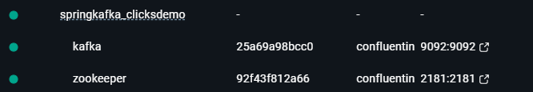
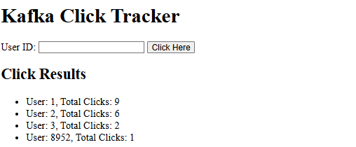

# Démo Spring Boot Kafka Click-Counts

## Description

Dans ce demo, nous allons développer une solution basée sur **Kafka Streams** et **Spring Boot** pour suivre et analyser les clics des utilisateurs en temps réel. L'objectif est de concevoir une application web où les utilisateurs peuvent cliquer sur un bouton, chaque clic étant enregistré et comptabilisé. Les données de clics seront traitées en temps réel à l'aide de Kafka Streams, et les résultats seront exposés via une API REST.

Ce demo vise à vous familiariser avec le fonctionnement de **Kafka**, **Kafka Streams**, et leur intégration avec **Spring Boot** dans une architecture orientée événements.

## Technologies utilisées

- **Spring Boot**
- **Kafka**
- **Kafka Streams**
- **Spring Kafka**
- **Thymeleaf** (moteur de templates)

## Installation

### 1. Configuration de Kafka avec Docker Compose

Créez un fichier `docker-compose.yml` avec le contenu suivant :

```yaml
version: '3.8'
services:
  zookeeper:
    image: confluentinc/cp-zookeeper:7.5.0
    container_name: zookeeper
    environment:
      ZOOKEEPER_CLIENT_PORT: 2181
    ports:
      - "2181:2181"

  kafka:
    image: confluentinc/cp-kafka:7.5.0
    container_name: kafka
    depends_on:
      - zookeeper
    ports:
      - "9092:9092"
    environment:
      KAFKA_BROKER_ID: 1
      KAFKA_ZOOKEEPER_CONNECT: zookeeper:2181
      KAFKA_ADVERTISED_LISTENERS: PLAINTEXT://localhost:9092
      KAFKA_LISTENER_SECURITY_PROTOCOL_MAP: PLAINTEXT:PLAINTEXT
      KAFKA_AUTO_CREATE_TOPICS_ENABLE: "true"
      KAFKA_OFFSETS_TOPIC_REPLICATION_FACTOR: 1
```

Démarrez les services Kafka et Zookeeper :

```bash
docker-compose up -d
```



### 2. Création des topics Kafka

Créez les topics `clicks` et `click-counts` :

```bash
# Créer le topic "clicks"
docker exec -it kafka kafka-topics --create --topic clicks --bootstrap-server localhost:9092 --partitions 3 --replication-factor 1

# Créer le topic "click-counts"
docker exec -it kafka kafka-topics --create --topic click-counts --bootstrap-server localhost:9092 --partitions 3 --replication-factor 1
```

Vérifiez la liste des topics :

```bash
docker exec -it kafka kafka-topics --list --bootstrap-server localhost:9092
```

Vous devriez voir :

```
clicks
click-counts
```

### 3. Lancer l'application Spring Boot

Compilez et exécutez l'application :

```bash
mvn clean install
mvn spring-boot:run
```

### 5. Utilisation de l'application

Accédez à l'application via le navigateur à l'adresse : [http://localhost:8080](http://localhost:8080)



Entrez votre ID utilisateur et cliquez sur le bouton pour enregistrer un clic. Le résultat sera affiché en temps réel.

### 6. Consommation des messages Kafka

Pour voir le contenu du topic `clicks` :

```bash
docker exec -it kafka kafka-console-consumer --topic clicks --from-beginning --bootstrap-server localhost:9092
```

Exemple de sortie :

```
user1
user2
user1
...
```

Pour voir le contenu du topic `click-counts` :

```bash
docker exec -it kafka kafka-console-consumer --topic click-counts --bootstrap-server localhost:9092 --from-beginning --property print.key=true --property print.value=true --property key.separator=" : "
```

Exemple de sortie :

```
user1 : 1
user2 : 1
user1 : 2
...
```

## Architecture de l'application

L'application est composée de :

- **Producteur Kafka** : Envoie les clics des utilisateurs au topic `clicks`.
- **Kafka Streams** : Traite les données en temps réel pour compter le nombre de clics par utilisateur, en écrivant les résultats dans le topic `click-counts`.
- **Consommateur Kafka** : Lit les données du topic `click-counts` et expose une API REST pour récupérer les compteurs de clics.